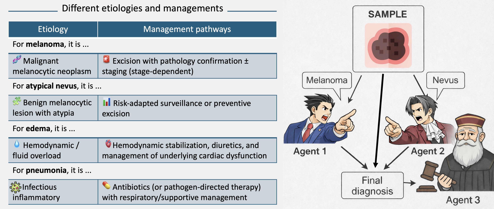

# [arXiv'26] Can Agents Distinguish Visually Hard-to-Separate Diseases in a Zero-Shot Setting? A Pilot Study

by Zihao Zhao, Frederik Hauke, Juliana De Castilhos, Sven Nebelung, and Daniel Truhn 

<!-- 

    

 -->

  

> 
 
> **Left** Despite highly overlapping visual patterns, some disease pairs can have totally different etiologies and managements, which makes imaging-only differentiation challenging and high-stakes
> **Right** The overview of our proposed Contrastive Agent Reasoning (CARE). Two disease-specific agents generate opposing evidence from the same input image. A judge agent adjudicates the arguments, flags unsupported evidence, and outputs the final diagnosis in a training-free, zero-shot setting.

## Overview

## Prerequisites

## Usage

## Acknowledgement

